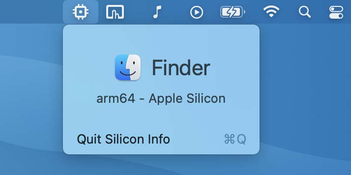
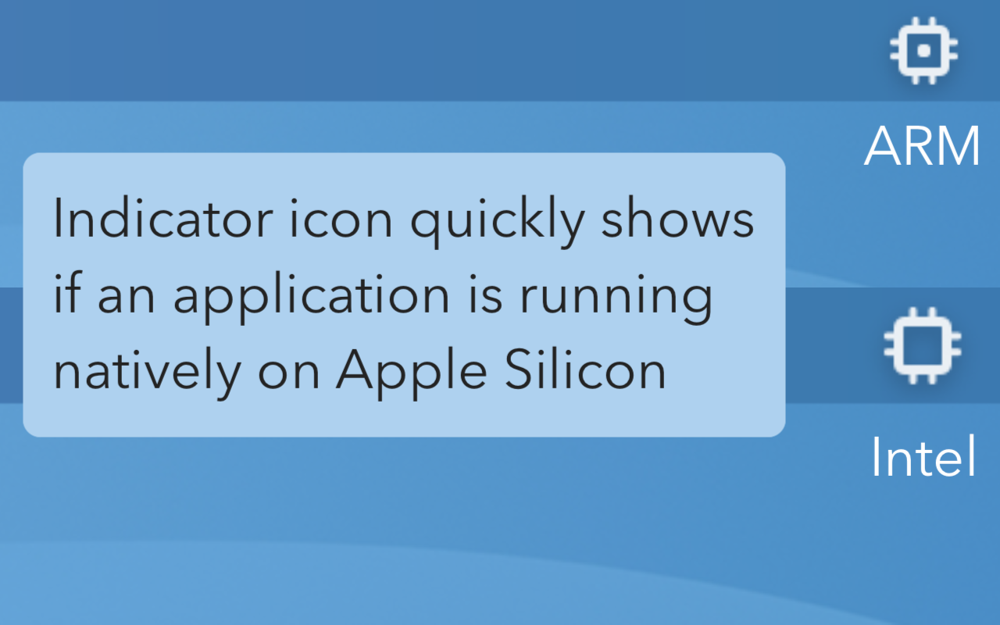
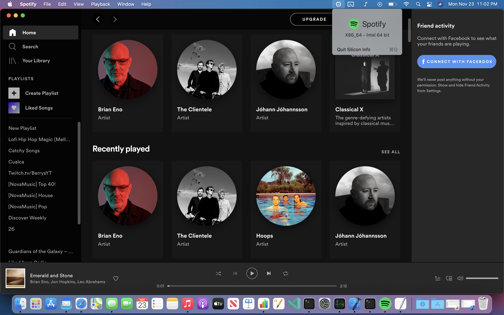

# Silicon Info

## About

Silicon Info is a tiny menu bar application allows the user to quickly view the architecture of the currently running application.

Useful for quickly determining if an application is running natively on Apple Silicon or running via Rosetta 2.

**Update**: [**Now on the Mac App Store**](https://apps.apple.com/us/app/silicon-info/id1542271266)

## Installation
### Download from Mac App Store
- [App store link](https://apps.apple.com/us/app/silicon-info/id1542271266)

### Download release from Github
- [Download zip](https://github.com/billycastelli/Silicon-Info/releases/download/1.0.3/Silicon.Info.app.zip) from repo
- Move .app file to Applications folder
- Open application
- If “`Silicon Info.app` can’t be opened because Apple cannot check it for malicious software" appears, open Systems Preferences to the Security and Privacy window.

- Select "Open Anyway"

## Screenshots
#### Indicator icon

#### Example of a native ARM application

#### Example of an application running using Rosetta

