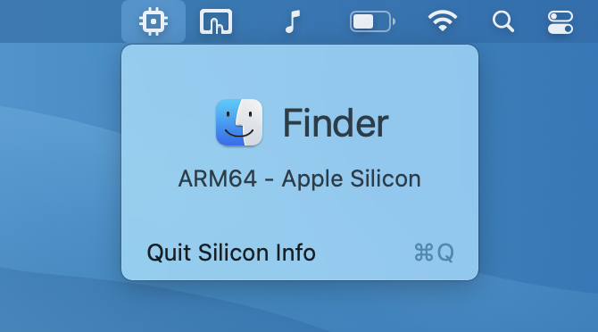

# Silicon Info

## About

Silicon Info is a tiny menu bar application allows the user to quickly view the architecture of the currently running application.

Useful for quickly determining if an application is running natively on Apple Silicon or running via Rosetta 2.

[Download zip](https://github.com/billycastelli/Silicon-Info/releases/download/1.0/Silicon.Info.app.zip) from repo

## Download
[Download zip](Silicon&#32;Info.zip) from repo

### Example of a native ARM application

### Example of an application running using Rosetta

